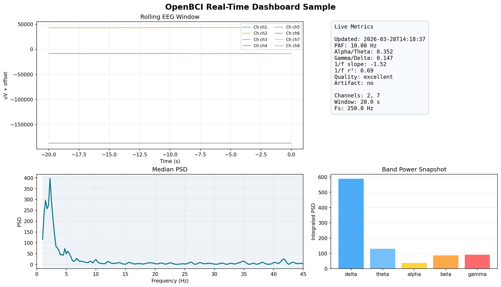
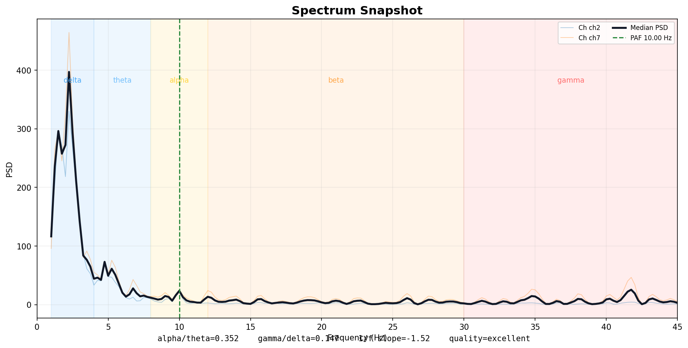
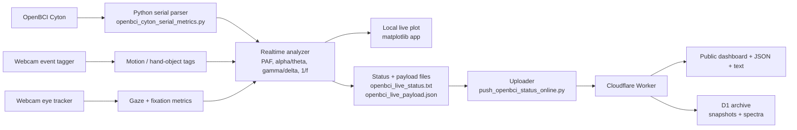

# OpenBCI Motion Tracking

Real-time EEG, webcam motion tagging, eye tracking, and public web streaming built around an OpenBCI Cyton.

This repo contains the standalone tooling produced on March 28, 2026 for:

- live `PAF`, `alpha/theta`, `gamma/delta`, and `1/f` estimation from a Cyton serial stream
- a scrolling desktop plot with EEG traces, PSD, and compact band-power history
- webcam-based motion and hand/object event tagging
- webcam-based coarse eye tracking and fixation metrics
- online publishing through a Cloudflare Worker with D1 archival

## Screenshots

### Local EEG dashboard sample



### Public spectrum sample



## Architecture



## Live Public URLs

- Live dashboard: [openbci-status-worker.simfish-openbci-live.workers.dev](https://openbci-status-worker.simfish-openbci-live.workers.dev/)
- Spectrum page: [openbci-status-worker.simfish-openbci-live.workers.dev/spectrum](https://openbci-status-worker.simfish-openbci-live.workers.dev/spectrum)
- Live rolling JSON: [openbci-status-worker.simfish-openbci-live.workers.dev/live.json](https://openbci-status-worker.simfish-openbci-live.workers.dev/live.json)
- Live text status: [openbci-status-worker.simfish-openbci-live.workers.dev/status.txt](https://openbci-status-worker.simfish-openbci-live.workers.dev/status.txt)
- Recent archived snapshots: [openbci-status-worker.simfish-openbci-live.workers.dev/history.json?limit=20](https://openbci-status-worker.simfish-openbci-live.workers.dev/history.json?limit=20)
- Recent archived spectra: [openbci-status-worker.simfish-openbci-live.workers.dev/spectra.json?limit=12](https://openbci-status-worker.simfish-openbci-live.workers.dev/spectra.json?limit=12)

## Main Components

### EEG streaming

- `openbci_cyton_serial_metrics.py`
- `openbci_cyton_realtime_metrics.py`
- `openbci_cyton_realtime_analyzer.py`
- `openbci_cyton_live_plot.py`

These scripts parse raw Cyton packets directly from serial, compute spectral metrics in rolling windows, and drive the local live display.

### Webcam analysis

- `webcam_event_tagger.py`
- `webcam_eye_tracker.py`
- `eye_fixation_metrics.py`
- `hand_object_eeg_correlation.py`

These scripts provide lightweight webcam-based event tagging, coarse gaze tracking, fixation summaries, and simple EEG-motion correlation.

### Online publishing

- `push_openbci_status_online.py`
- `openbci_status_worker/`
- `OPENBCI_ONLINE.md`

These components publish the latest live payload online and archive snapshots to Cloudflare D1.

## Quick Start

Run the live EEG plot:

```bash
python3.11 openbci_cyton_live_plot.py --serial-port /dev/cu.usbserial-DN00954N
```

Run the webcam event tagger:

```bash
python3.11 webcam_event_tagger.py --stdout-mode heartbeat
```

Run the webcam eye tracker:

```bash
python3.11 webcam_eye_tracker.py --stdout-mode heartbeat
```

Push live status online:

```bash
python3.11 push_openbci_status_online.py \
  --status-path openbci_live_status.txt \
  --payload-path openbci_live_payload.json \
  --status-url https://openbci-status-worker.simfish-openbci-live.workers.dev/update \
  --live-url https://openbci-status-worker.simfish-openbci-live.workers.dev/live \
  --token <STATUS_TOKEN>
```

## Notes

- Runtime outputs, caches, previews, and generated status files are excluded from version control.
- Webcam tracking is heuristic and intended for coarse event tagging, not calibrated computer vision.
- The Cloudflare worker is configured for Workers + KV + D1.
